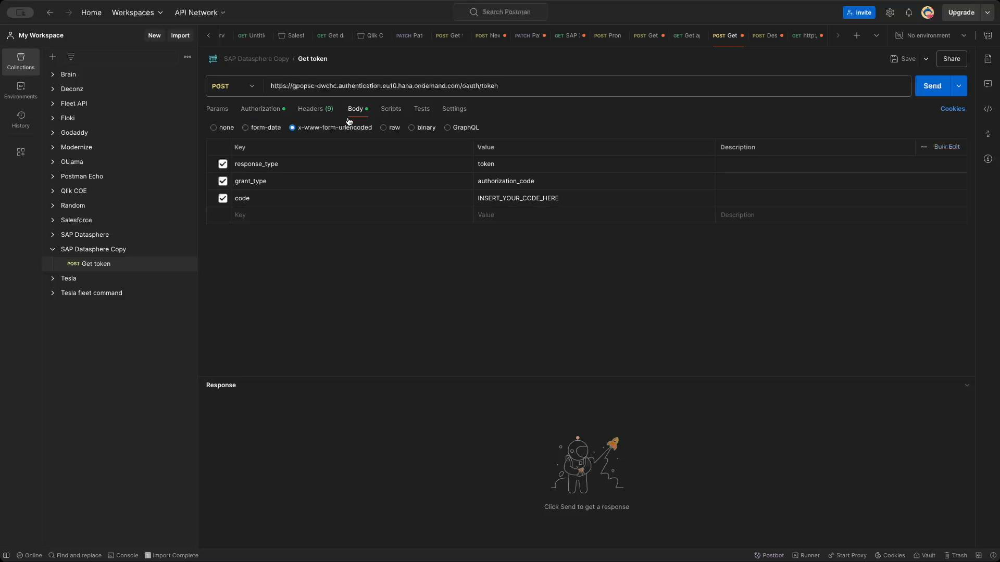

## Connecting Click Sense to SAP DataSphere

This guide outlines the steps to connect Click Sense to SAP DataSphere using OAuth. 

### Step 1: Create an OAuth Client

1. Access SAP DataSphere.  
2. Click the hamburger menu in the top left corner. 
3. Select **System**, then **Administration**. 
4. Go to the **App Integration** tab. 
5. Click **Add a New OAuth Client**. 
6. Ensure the following settings are configured for the OAuth Client:
    - **Purpose:** Interactive Usage
    - **Authorization Grant:** Authorization Code
    - **Redirect URI:** `https://connector.qlikcloud.com/callback`
    - **Access Token Lifetime:** 1 day maximum
    - **Refresh Token Lifetime:** 30 days

7.  After the client is created, note the Client ID and Client Secret. The secret will not be visible again after this step, so make sure to copy it.

### Step 2: Get the Authorization Code

1. Open a browser and go to the following URL, replacing `<site_name>` with your specific site name. 
   `https://<site_name>.authentication.eu10.hana.ondemand.com/oauth/authorize?response_type=code&client_id=<clientid>`
2. Use your browser's developer tools to URL-encode the `client_id` before pasting it into the URL and hitting enter. `encodeURIComponent('YOUR_CLIENT_ID')`   
3.  You will get a 403 error after hitting enter, this is expected. Copy the authorization code from the browser URL. The code is the string after `code=` in the URL.  

### Step 3: Use Postman to Get Access and Refresh Tokens

1. Download the Postman collection from the provided GitHub repository. 
2. In Postman, click **Import**, and select the downloaded JSON file. 
3. In the **Get Token** request, enter your Client ID and Client Secret in the Authorization tab as the username and password. 
4. In the request body, paste the authorization code obtained in the previous step into the value of the `code` key. 
5. Click **Send**. 
6. Copy the `access_token` and `refresh_token` from the response.
### Step 4: Create the JSON File

1. Create a JSON file called `datasphere.json` and paste the `access_token` and `refresh_token` obtained from Postman. Set the `expires_in` and `created_at` values to 0. 
2. Save the JSON file to the Qlik Application Automation supported cloud storage of your choice.  

### Step 5: Import and Configure the Automation

1. Create a blank automation. 
2. Import the automation by right clicking and selecting **Upload workspace**.   
3. Modify the automation by updating the following:
    - **Variable - filePath:** Path to the `datasphere.json` file in your cloud storage. 
    - **Variable - clientId:** Your Client ID 
    - **Variable - clientSecret:** Your Client Secret 
4. Select a OneDrive block and select your OneDrive connection and apply it to all blocks. 

### Step 6: Import the Qlik Sense App and Set up REST Connections
1.  Go to **Create** and upload the Qlik Sense app (`SAP Datasphere.qvf`).  
1. In the Qlik Sense app, go to the data load editor.
2. Create two REST connections:
    - **SAP Datasphere Metadata:**  For metadata, use a dummy URL (eg. `https://httpbin.org/get`). Enable **Allow WITH CONNECTION**.  
    - **SAP Datasphere REST:** For metadata, use a dummy URL (eg. `https://httpbin.org/get`). Enable **Allow WITH CONNECTION**. For this connection make sure you set the timeouts to 3000 as this connection will be used to extract data from SAP Datasphere and therefore needs to have a higher timeout. 
3. Update the script variables with the correct values:
    - **metadataUrl:** The URL of the SAP Datasphere Metadata REST connection.
    - **dataConnectionName:** The name of the SAP Datasphere REST connection.
    - **siteName:** The name of your SAP Datasphere site.
    - **tenant:** Your Qlik Cloud tenant name.
    - **automationId:** The ID of the automation you created earlier.
    - **automationExecutionToken:** The execution token of the automation you created earlier. Can be found by clicking on the Start block of the automation
  
4. You should now be able to load data from SAP Datasphere. You can test the connection by calling the getDatasphereData SUB function with the correct parameters. The parameters are:
    - **space:** The name of the SAP Datasphere Space. **Required**
    - **asset:** The name of the SAP Datasphere Asset. **Required**
    - **parameters:** The OData parameters. This can be an empty string if no parameters are needed. **Required**
    - **type:** The type of asset (eg. `relational` or `analytical`). **Required**
